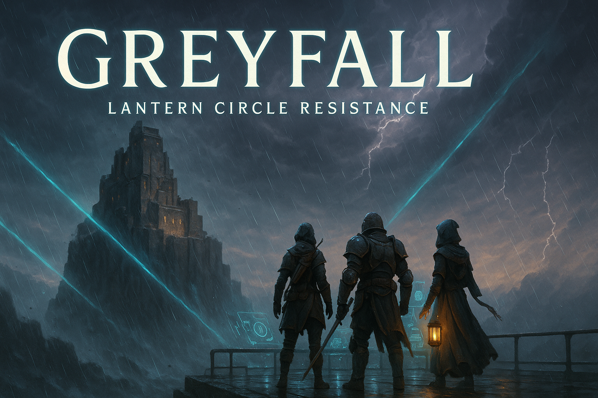

# Greyfall



## Contents
- [Showcase](#showcase)
- [Enter the Storm](#enter-the-storm)
- [Play the Lantern Circle](#play-the-lantern-circle)
- [What the Watchpost Provides](#what-the-watchpost-provides)
- [Campaign Threads](#campaign-threads)
- [Mission Seeds](#mission-seeds)
- [Table Rhythm](#table-rhythm)
- [Safety & Tone Dials](#safety--tone-dials)
- [Quick Start](#quick-start)
- [Learn More](#learn-more)
- [License](#license)
- [한국어 안내](#한국어-안내)

Greyfall is the narrative watchpost operated by the Lantern Circle resistance in the Greyfall tabletop campaign. When an interdimensional storm tears across the Solas Basin, the Lantern Circle rallies scientists, mystics, and partisan cells to hold the last fortress-city together. This watchpost lets you stage their desperate missions, track the creeping storm, and keep the lights of hope burning.

## Showcase

<video controls autoplay loop muted playsinline width="100%" poster="public/2ae0a171-2b1d-4005-9697-1f239e60cce0.png">
  <source src="public/showcase.mp4" type="video/mp4" />
  <p>
    Your browser does not support the video tag. You can
    <a href="public/showcase.mp4">download the showcase trailer</a>.
  </p>
</video>

## Enter the Storm

- Ten years ago, the first Greyfall split the sky, toppled solar arrays, and drowned coastal cities in psychic ash.
- The Lantern Circle founded the Citadel of Kyon, a basalt arcology sheltering refugees, Glow reactors, and clandestine research labs.
- Opposing factions pull at the basin: the Stormforged Syndicate weaponises anomalies, the Ash Choir broadcasts mind-breaking hymns, and mercenary Free Companies barter for Glow.
- Greyfall’s tone is catastrophic hopepunk: brutal weather, luminous technology, and communal resilience share the spotlight.

## Play the Lantern Circle

- Step into roles drawn from the Circle’s four divisions—Recon, Vanguard, Aegis, and Arcana—each bringing tactical insight and personal flaws to the table.
- Track **Glow** (shared hope) and **Corruption** (the storm’s taint) while juggling mission clocks, storm fronts, and alliances inside the Citadel.
- Advance character arcs through scars, bonds, and faction favors as the storm escalates toward an inevitable Convergence.

## What the Watchpost Provides

- **Living Tactical Stage:** React + PixiJS render the battlefield so tokens, fog of war, and mission clocks stay synchronized with the fiction.
- **Mission Logbook:** The watchpost records briefings, twists, and outcomes so you can pick up the story mid-crisis.
- **Shared Comms:** Integrated WebRTC chat keeps remote tables in character and in sync.
- **LLM Bridge (prototype):** Optional prompts help improvise complications, NPC voices, or storm anomalies without breaking the flow.

## Campaign Threads

- **Shattered Weathergrid:** Reignite orbital mirrors before the Syndicate weaponises them or rival scientists defect.
- **Echoes of the Choir:** Trace the Ash Choir’s psalm broadcasts, rescue enthralled civilians, and decide whether to purify or repurpose the song.
- **Stormcaller Gambit:** Defecting storm-shapers plead to join the Circle—welcome them, exile them, or risk a ritual gone wrong.
- **Citadel’s Heart:** Internal sabotage threatens Kyon’s Glow reserves, forcing political maneuvering and desperate defenses.
- **The Convergence:** Multiple storm fronts align for a final assault; seal the rift, orchestrate an exodus, or embrace assimilation.

## Mission Seeds

- Escort refugees across the Glass Tempest in **Operation Emberline** while negotiating with mercenary escorts.
- Dive into flooded transit tunnels during **Quiet Depths** to recover an OPFS core before the Choir rewrites it.
- Climb shattered skyscrapers in **Second Sun** to restart a fallen solar array amid feral storm drones.
- Track a missing recon squad in **Hollow Voices**, uncovering a Stormcaller shrine that distorts perception.
- Strike a Syndicate manufactory in **Breath of Iron** before tainted munitions flood the Citadel.

## Table Rhythm

1. **Briefing:** Name the storm front, active clocks, environmental hazards, and key NPC stakes.
2. **Engagement:** Assess position (controlled, risky, desperate) and effect (limited, standard, great) before the first roll.
3. **Action:** Roll 1d20 + attribute + discipline against Threat DCs; failures push the fiction forward through advancing clocks, fallout, or corruption.
4. **Resistance & Support:** Spend Glow to push, assist, or reroll; absorb consequences through scars, resources, or faction favors.
5. **Downtime:** Between missions, recover, research, forge bonds, or tinker—each pushing personal and faction clocks.

## Safety & Tone Dials

- Use Lines & Veils or the watchpost’s `/pause` macro to hold space for player safety, especially around apocalyptic imagery and body horror.
- Shift the dial between **Grit** (resource scarcity), **Heroic** (daring rescues), and **Mystic** (rituals and visions) to match your table’s comfort.

## Quick Start

You only need Node.js 18+ and npm 9+ to run the watchpost locally:

```bash
npm install
npm run dev
```

Open the provided URL to explore the lobby, ready room, and tactical stage.

## Learn More

- `docs/story.md`: Setting bible outlining timeline, factions, NPCs, and finale options.
- `docs/rulebook.md`: Tactical rules, clocks, Glow economy, and downtime actions.
- `docs/scenes.md`: Sample narration beats to drop directly into mission briefings.
- `docs/rtc-protocol.md`: Signal flow reference if you host your own comms server.

## License

Released under the *Greyfall Console Non-Commercial License* (`LICENSE`). Use is limited to Greyfall internal evaluation and non-commercial sessions unless explicitly permitted by the Greyfall operations team.

## 한국어 안내

Greyfall 감시 데크는 Greyfall 캠페인에서 랜턴 서클 레지스탕스가 운용하는 전술 관제 플랫폼입니다. 이계의 폭풍이 솔라스 분지를 뒤덮자, 랜턴 서클은 과학자, 주술가, 저항 세력을 모아 마지막 요새 도시를 지켜냅니다. 이 감시 데크를 통해 긴박한 임무를 설계하고, 폭풍의 흐름을 추적하며, 공동체의 희망을 놓치지 않을 수 있습니다.

### Greyfall 세계 한눈에 보기

- 10년 전 Greyfall 폭풍이 하늘을 갈라 태양광 어레이를 붕괴시키고, 정신을 갉아먹는 재를 뿌려 해안 도시들을 초토화했습니다.
- 랜턴 서클은 난민, Glow 반응로, 비밀 연구동을 품은 현무암 요새 **키온**을 구축해 최후의 방어선을 세웠습니다.
- 스톰포지드 신디케이트(폭풍 에너지를 무기화), 잿빛 성가대(정신 교란 송신), 프리 컴퍼니(Glow 거래) 등 여러 세력이 분지에서 충돌합니다.
- Greyfall의 분위기는 ‘파국적 호프펑크’입니다. 폐허 속의 초과학 기술, 협동을 잃지 않는 공동체, 폭풍이 불러오는 절망이 동시에 어우러집니다.

### 랜턴 서클로 플레이하기

- 정찰·선봉·방벽·비전 4개 분과 중 하나를 맡아 각자의 전문성과 상처를 테이블에 끌어옵니다.
- 임무 시계, 폭풍 전선, Citadel 내부 동맹을 조율하며 **Glow**(서클이 공유하는 희망)과 **타락**(Greyfall 오염)을 균형 있게 관리합니다.
- 흉터, 유대, 파벌 호의를 쌓아 갈수록 폭풍이 수렴하는 마지막 순간까지 캐릭터 서사가 깊어집니다.

### 감시 데크 핵심 기능

- **쇼케이스:** README 상단 Showcase 섹션에서 Greyfall 감시 데크의 분위기를 영상으로 미리 확인하세요.
- **실시간 전술 스테이지:** React + PixiJS 기반 보드가 토큰, 전장의 안개, 임무 시계를 테이블 서사와 동기화합니다.
- **임무 로그북:** 브리핑, 돌발 사건, 결말을 기록해 다음 세션에서도 바로 상황을 이어갈 수 있습니다.
- **공유 통신:** 내장 WebRTC 채널로 원격 플레이어도 동일한 화면과 리듬으로 소통합니다.
- **LLM 브리지(프로토타입):** 난이도 조정, NPC 음성, 돌발 상황을 즉석에서 도와주는 선택형 프롬프트를 제공합니다.

### 캠페인 주요 줄거리

- **부서진 기상망:** 궤도 거울을 재가동하기 전 스톰포지드와 배반 과학자를 상대해야 합니다.
- **성가의 메아리:** 잿빛 성가대 송신을 추적하며 세뇌된 민간인을 구출하고, 성가를 정화할지 무기화할지 결정합니다.
- **스톰콜러 도박:** Greyfall과 공명하는 전향자들을 받아들일지, 추방할지, 위험한 의식을 감행할지 선택해야 합니다.
- **요새의 심장:** 내부 사보타주가 키온의 Glow 비축을 노립니다. 정치 공작과 전면 방어가 맞부딪힙니다.
- **수렴:** 여러 폭풍 전선이 동시에 몰려옵니다. 균열을 봉인할지, 대탈출을 추진할지, Greyfall과의 융합을 선택할지 결정해야 합니다.

### 임무 시드 예시

- **엠버라인 작전:** 글래스 템페스트 폭풍을 헤치며 난민 호송로를 확보하고 용병단과 협상합니다.
- **고요한 심연:** 침수된 지하철을 잠수해 OPFS 코어를 회수하고 잿빛 성가대의 개조를 저지합니다.
- **두 번째 태양:** 붕괴 직전 마천루를 올라가 태양 어레이를 재기동하며 폭풍 드론의 맹공을 버팁니다.
- **공허한 목소리:** 실종된 정찰 분대를 추적하다 Greyfall 공명 제단이 의식을 왜곡시키는 현장을 발견합니다.
- **철의 숨결:** 타락 탄약을 양산하는 스톰포지드 공장을 폭파해 Citadel을 지킵니다.

### 세션 진행 흐름

1. **브리핑:** 폭풍 전선, 활성 시계, 환경 위험, 핵심 NPC 이해관계를 공유합니다.
2. **교전 선언:** 첫 롤 전에 위치(안전·위험·절박)와 효과(제한·표준·강력)를 결정합니다.
3. **액션 해소:** 능력치 + 분과를 더한 1d20으로 Threat DC를 상대합니다. 실패도 이야기를 앞으로 밀어내는 요소로 활용합니다.
4. **저항·지원:** Glow를 소비해 푸시하고, 동료를 지원하거나 결과에 저항해 서사의 충격을 완화합니다.
5. **휴식 라운드:** 임무 간에 회복, 조사, 유대 강화, 제작을 통해 개인·파벌 시계를 전진시킵니다.

### 안전 장치와 분위기 조절

- 세션 전 Line & Veil 협의를 마치고 감시 데크 `/pause` 매크로를 활용하면 종말 이미지나 신체 공포 장면에서 안전하게 속도를 조절할 수 있습니다.
- 테이블 분위기는 **그릿**(자원 관리 중심), **영웅담**(구조와 희생), **신비**(의식과 환시) 다이얼로 조정해 보세요.

### 빠른 시작 가이드

로컬 환경에 Node.js 18 이상, npm 9 이상만 갖추면 바로 실행할 수 있습니다.

```bash
npm install
npm run dev
```

터미널에 표시된 주소로 접속하면 로비, 준비실, 전술 스테이지를 바로 탐색할 수 있습니다.

### 참고 자료

- `docs/story.md`: Greyfall 연표, 파벌, 핵심 NPC, 피날레 선택지를 정리한 스토리 바이블.
- `docs/rulebook.md`: 전술 규칙과 시계 운용, Glow·타락 시스템, 휴식 절차.
- `docs/scenes.md`: 임무 브리핑과 장면 전환에 활용할 수 있는 나레이션 예시.
- `docs/llm-pipeline.md`: LLM 파이프라인 구조와 파인튜닝 전략 아키텍처 문서.
- `docs/rtc-protocol.md`: 독자적인 시그널 서버를 운영하고 싶을 때 참고할 RTC 프로토콜 가이드.

### 라이선스

`LICENSE`에 명시된 *Greyfall Console Non-Commercial License*를 따릅니다. Greyfall 내부 검토와 비상업적 세션 외의 사용에는 Greyfall 운영진의 별도 승인이 필요합니다.
